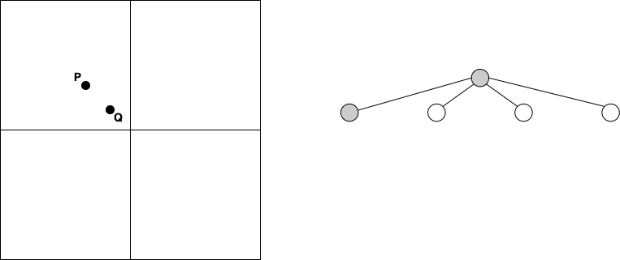

## Introduction to PR Quadtrees

## Introduction

A quadtree is a data structure that stores *d*-dimensional points and enables efficient search for the stored points. We will only consider the case *d*=2. One particular quadtree which can be used to store 2-dimensional points is the *point-region* quadtree, simply referred as a *PR quadtree*. A binary tree can be defined as a finite set of nodes that are either empty or have a root and two binary trees *Tl* and *Tr* (the left and right subtree). A quadtree has a similar recursive definition: instead of two subtrees we have four subtrees, hence the name quad. This means that each node either has four children or is a leaf node. The four leaf nodes are often referred to as NW, NE, SW, SE (see the figure below).

## Building a PR Quadtree (Inserting Datapoints)

In a PR quadtree, each node represents a rectangle that covers part of the area that we wish to index. The root node covers the entire area. A PR quadtree is built recursively: we first start with an initial rectangle that should contain all the points we wish to store (how could you find a rectangle for *n* 2-dimensional points so that it contains all given datapoints?). To then construct a PR quadtree of a set of *n* points, we insert the points one by one and recursively subdivide a rectangle into four equally sized sub-rectangles whenever a rectangle would contain more than a single point. After the insertion process is complete, every leaf node is either coloured in *black* (contains a single datapoint) or *white* (indicating that the node is empty), and internal nodes are coloured in *grey* (see the figure above).

Alternatively, you could also use the following strategy: we insert all points into the rectangle and recursively partition each rectangle into 4 quadrants (sub-rectangles) until each rectangle contains at most one point.

The construction of a PR quadtree also leads to one important difference between them and binary trees: a binary tree depends on the order of value insertion whereas a PR quadtree is independent of the order of datapoint insertion. The reason is that the nodes are independent from the inserted datapoints (the rectangles are determined by the initial rectangle of the root node).

## Search

To enable efficient search, the rule is that *every leaf node in a PR quadtree either contains a single point or no point at all*. *Every node in a PR quadtree is either a leaf node or an internal node*, i.e., has four children representing a subdivision of the current rectangle into four equally sized quadrants. The region of an internal node always contains more than one point.

If we search for a single datapoint using its 2*D* coordinates, we first check if the point lies in the quadtree. If it does, we recursively compute on each level the sub-rectangle that contains the coordinates of the datapoint to be searched until we reach a leaf node. The leaf node either contains the datapoint or it does not.

## Example

Here is a running example where we start with an empty PR quadtree, i.e., the we have a single white node, indicating we one leaf that is empty:

We insert the first point *P*. We can simply colour the root node as black as we have only a single point.

We insert a second point *Q*. Note that the colour changes from black to grey as the root node becomes an internal node (a leaf node can only hold a single datapoint but now holds two):

Since the root is an internal node, we have to subdivide the rectangle into four sub-rectangles and have to add four children in the corresponding quadtree. However, since both points are still located in the same sub-rectangle NW, we colour this node as grey as well in the corresponding quadtree which has now a root and four leaves:

Hence, we subdivide the NW rectangle further into four sub-rectangles. We add four more children nodes to the grey node that we coloured as grey in the previous step:

Since this subdivision again does not lead to *P* and *Q* being in separate rectangles, we have to add another layer to the quadtree, i.e., subdivide the rectangle that includes both points once more into four rectangles. Since *P* and *Q* are now in separate rectangles, the corresponding nodes become leaves in the quadtree coloured in black and the two other children are simply coloured white. We have now completed the update of inserting *Q*:

Finally, we insert a third point *R*. This is a simple case, because the leaf on the first level is empty, i.e., we simply colour the SE node on the first level of the quadtree as black:

## Further References

- Here is a good introduction to PR quadtrees that has some animated visualisations: [link](https://opendsa-server.cs.vt.edu/ODSA/Books/CS3/html/PRquadtree.html).
- You might also find this demonstration useful in deepening your understanding: [link](https://google.github.io/closure-library/source/closure/goog/demos/quadtree.html).

---

## Your Task

Your implementation of a PR quadtree has to support a number of functions to store data points and to search for them. You will need to implement functions to support inserting data points, searching for individual datapoints and searching (returning) for all datapoints within a query rectangle.

### Insertion

To insert a data point into a PR quadtree we start with the root node. If the PR quadtree is empty, i.e., the root node is coloured as white (which we represent as a pointer to NULL) and the point lies within the area that should be covered with the PR quadtree, the data point becomes the root. If the root is an internal node, we compute in which of the four children the data points lies (of course, if the data point lies outside of root rectangle, it is not inserted and an error message returned). Again, if the corresponding node is an internal node, we recursively repeat this process until we find a leaf node. If the leaf node is empty, we simply insert the point. If the leaf node is black, i.e., has already one node, we need to split the leaf node into four children, i.e., the existing black leaf node becomes a grey internal node. We repeat splitting the node until we find an internal node so that two of its children contain the existing and the newly inserted datapoint, i.e., are black leaf nodes. In other words: splitting a black leaf can also led to a recursive process.

### Find (Search)

To find a datapoint (and often its associated information), we simply traverse the PR quadtree by selecting the internal child node whose rectangle contains the location of the datapoint. The search stops once we have reached a leaf node. If the leaf node has stored the datapoint, we return its associated information; otherwise the search simply reports that the datapoint is not stored in the PR quadtree.

### Range (Window) Query

An important query is to report all datapoints whose locations are contained in a given query rectangle. This query is typically called a range or window query. To run range query on a quadtree, we have the following recursive process: we start the root and check if the query rectangle overlaps with the root. If it does, we check which children nodes also overlap with query rectangle (this could be all of them for a centred query rectangle). Then we repeat this procedure for all internal children overlapping with the query rectangle. The recursion stop once we have reached the leaf level. We return the datapoints from all black leaf nodes whose datapoints are located within the query rectangle.